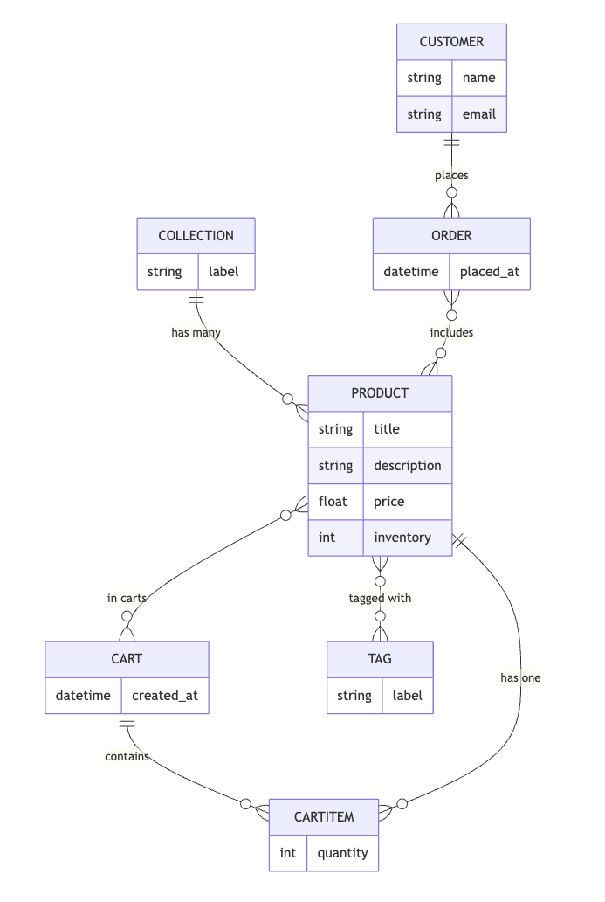

# Django - An Introduction

## 1. Project Setup

### First things first

Let us navigate to the directory and create a virtual environment for the project. Let's type the command

```bash
PIPENV_VENV_IN_PROJECT=1 pipenv install django
```

Here are some descriptions about the command

- It uses Pipenv, a tool that manages Python dependencies and virtual environments, to install the `django` packages into a project.
- The line `PIPENV_VENV_IN_PROJECT=1` tells pipnv, **Rather than using the global shared space create a virtual environment inside the project**

### Create a project

Now coming to the project creation.

```bash
pipenv run django-admin startproject storefront .
```

- `pipenv run django-admin startproject storefront` runs the command inside the pip virtual environemnt
- The `.` at the end tells Django to create the project in the current directory, not a subfolder

### Opening the Shell

Activating the virtual environment we previously created is the standard way to go.

```bash
pipenv shell
```

### Runing the server

If we run the command `django-admin runserver`, it will not run as django-admin does not know which project to run. Instead all the necessary commands needed to run the server are inside the `manage.py` (It was generated when we created the project).

Hence we can run the project using

```bash
python manage.py runserver
```

## Creating an App

In the directory the django project was created, we will type the command

```bash
python manage.py startapp playground
```

It will create an app with playground. Inside the app we can see multiple files. Let's go one by one to describe their responsiblities

1. The `migrations` folder is responsible for generating database tables. More about this in the future section.
2. In the `admin.py` we declare how the admin inteface is going to look like for this app.
3. The `apps.py` is where we configure the app.
4. In the `models.py` we pull out data from the database to show to user.
5. Test module is where we write our tests.
6. Views is responsible for request handler.

## Views

HTML is a request response protocol. These is where we use views in Django. In a nutshell, a view function takes a request and returns a response. More accurately it's request handler.

### Url Configuration

When we want to configure the urls, it should starts with the app. Please note, we don't call the function we just mention the name of it without using '()'

```python
from django.urls import path
from . import views

# URLConf
urlpatterns = [
    path('playground/hello', views.say_hello)
]
```

We have declared the URL in the `playground` app. However, the project does not know the route yet. Hence, it order to let it know, we have to add it into the `urls.py` of the main project.

```python
urlpatterns = [
    path("admin/", admin.site.urls),
    path('playground/', include('playground.urls'))
]
```

What is essentially tells, django when any request comes with 'playground', navigate it to the urls of playground app.

In django, every url must end with a '/' and since`playground` has already been mentioned into the `urls.py` of the main app.

```python
urlpatterns = [
    path('hello/', views.say_hello)
]
```

## Templates

As we have already known views in django are not views exactly. Templates are the real views in django. Let's create a **templates** folder inside the migrations folder. Let's write `<h1>Hello World!</h1>` inside the folder.

> When rendering a template, the django app looks for the `hello.html` inside the the template folder of the `playground` app. If it's there, it renders it accordingly.

## Django Debug Toolbar

In order to add django-toolbar to VS code project, hop into this [link](https://django-debug-toolbar.readthedocs.io/en/latest/installation.html)

# 2. Entity Diagram

For more demonstation of django ORM (object relation mapping), we will use an ecommerce app. Please have a look at the ER diagram for more details.


